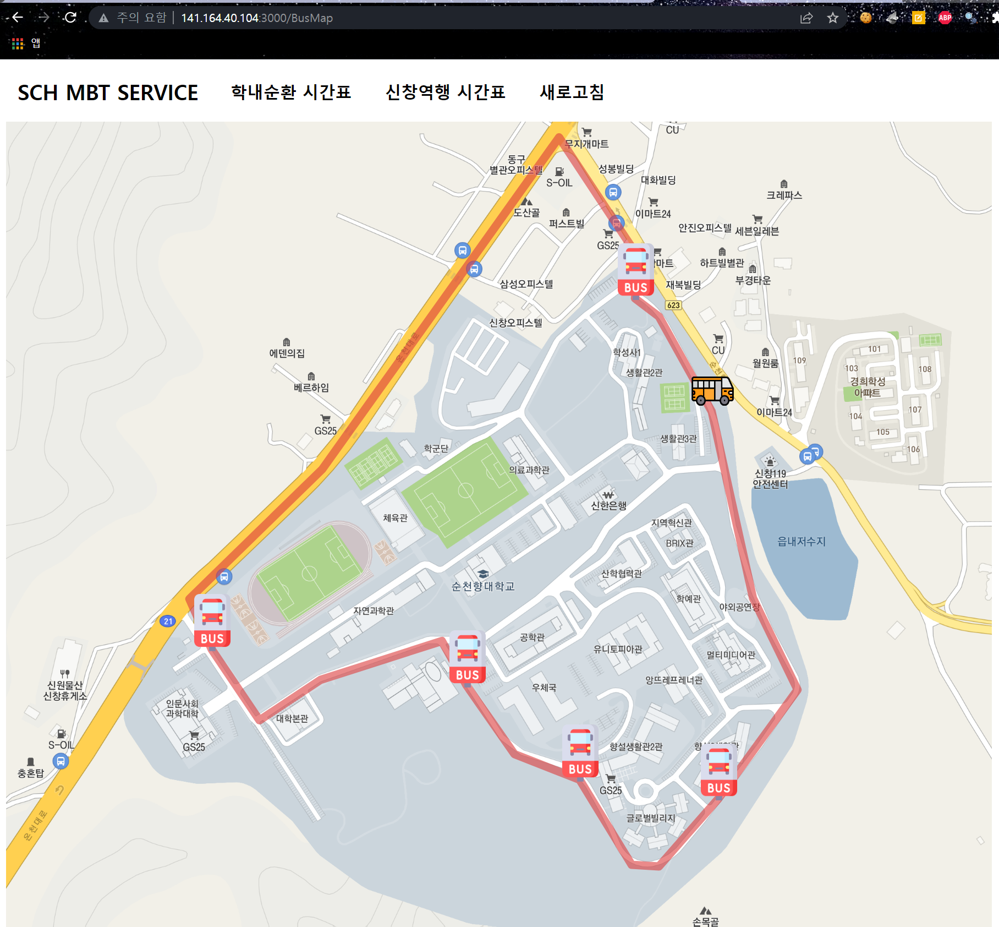

# Bus Tarcking

> 순천향대 학내순환 버스를 실시간 추적하는 서비스
> 
> 학내순환 버스 위치를 확인하여, 타 단과대 이동을 보다 유동적으로 하기 위함을 목표

### 기술 스택

* `Html` + `CSS` + `Javascript`
* `Node.js` + `Express`
* `Kakao Map Api`
[kakao Map Api](https://apis.map.kakao.com/web/)

### 제약

업체와 협의를 못해 실서비스는 불가능 하지만 어떤 분야에서도 쓸 수 있게끔  
위치값만 받으면 해당 위치를 Web에서 실시간으로 확인 할 수 있는 서비스를 구현함

## 시연

[MBT Service](http://141.164.40.104:3000/BusMap)

